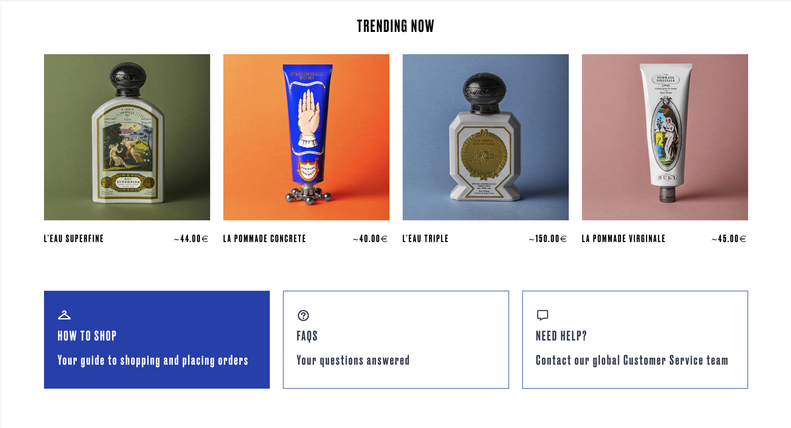

# Fancy Cloth Brand Website

Welcome to the official **Fancy Cloth Brand** website repository. This project is a sophisticated e-commerce platform for a high-end clothing brand. Designed to offer a seamless shopping experience, the website combines elegant visuals with intuitive user interaction. It is built using modern technologies, ensuring responsiveness across devices.

---

# Main Page


---

# Collection Page


# New Arrival Page

  

---

# Label & Brand Page

  

---

# Sale Page


# Cart Page

  <div style="flex: 1; padding-right: 20px; font-size: 20px;">
    **Coming Soon**
  </div>

---

# Login Page

  <div style="flex: 1; padding-right: 20px; font-size: 20px;">
    **Coming Soon**
  </div>

---

# Profile Page

  <div style="flex: 1; padding-right: 20px; font-size: 20px;">
    **Coming Soon**
  </div>
</div>

---

# Header

  

---

# Footer

  

---

# Others

<div style="display: grid; grid-template-columns: repeat(2, 1fr); gap: 20px;">
  <div>
    
  </div>
  <div>
    
  </div>
  <div>
    
  </div>
  <div>
    
  </div>
</div>

## 🚀 Technologies Used

- **JavaScript (React.js)**: Utilized to build dynamic and interactive user interfaces.
- **Sass**: For modular, maintainable, and efficient styles.
- **Tailwind CSS**: Ensures responsive design across devices.
- **FontAwesome & Google Fonts**: For high-quality typography and icons.
- **Axios**: For making API calls to fetch product data dynamically.
- **React Router**: Manages routing and navigation in a single-page application.
- **Node.js**: For the backend server to manage user authentication and data.

---

## 🔧 Installation

1. Clone this repository:
   ```bash
   git clone https://github.com/meso1007/React-original-selectshop-website
   cd fancy-cloth-brand
   ```
2. Install the dependencies:

   ```bash
   npm install
   ```

   3, Run the development server:

   ```bash
   npm start
   ```

   This will start the app on your local machine, and you can view it by navigating to http://localhost:3000.

   4, Build the project for production:

   ```bash
   npm run build
   ```

   The production build will be created in the build directory, optimized for performance.

   5, Deploy to GitHub Pages: If you wish to deploy your app to GitHub Pages, run:

   ```bash
   npm run deploy
   ```

   This command will build the project and deploy it to the GitHub Pages branch.

   6, Access the live version: Once deployed, your website will be accessible via the GitHub Pages URL, typically in the format:

   ```bash
   https://github.com/meso1007/React-original-selectshop-website
   ```
